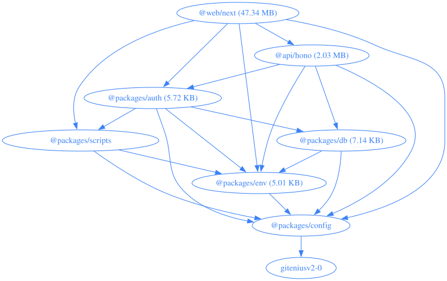

# Giteniusv2.0

Gitenius is an AI-powered GitHub profile analyzer and AI developer portfolio generator.
This version (`v2.0`) has been fully migrated into a modern Turborepo built on top of [ZeroStarter](https://zerostarter.dev).

## Architecture

- **Frontend:** Next.js (App Router), React, Tailwind CSS, shadcn/ui, Recharts.
- **Backend:** Hono API running on Bun, deployable to Vercel (`api/hono/vercel.json`) or as a container (`api/hono/Dockerfile`), utilizing `@google/genai` for profile analysis.
- **Data:** Postgres via Drizzle ORM, with Better Auth for sessions.
- **Tooling:** Bun, Turborepo, oxlint, oxfmt, Lefthook, Portless.

### Workspace build graph

How the workspaces depend on each other, with the built output size of each package:



Regenerate it after a dependency change with `bun .github/scripts/build-sizes.ts --graph` (run against a fresh `bun run build`). The `--graph` flag is opt-in so the SVG does not churn on every commit; the release workflow refreshes it when cutting a version.

## Features

- **AI Profile Analysis:** Generates an AI-driven executive summary and developer archetype for a GitHub user.
- **Activity Visualization:** Showcases language distribution, commit activity, and repo statistics with rich interactive charts.
- **Export to PDF:** Download the generated AI resume / developer portfolio as a clean PDF.
- **Smart Tech Stack Matching:** The AI identifies the developer's core tech stack and soft skills.

## Development

```bash
bun install
cp .env.example .env
bun run dev
```

This serves named `.localhost` dev URLs via portless (`bunx portless list` shows them); `PORTLESS=0 bun run dev` uses fixed ports instead (web `:3000`, api `:4000`).

### Environment

`POSTGRES_URL` and `BETTER_AUTH_SECRET` have no defaults. Fill both in before the first run, or the build fails during env validation:

| Variable                                    | Required | Notes                                                                                                                                      |
| ------------------------------------------- | -------- | ------------------------------------------------------------------------------------------------------------------------------------------ |
| `POSTGRES_URL`                              | yes      | Any Postgres connection string. `bunx pglaunch -k` provisions a local one.                                                                 |
| `BETTER_AUTH_SECRET`                        | yes      | Generate with `openssl rand -base64 32`.                                                                                                   |
| `GEMINI_API_KEY`                            | no       | Powers the AI analysis. Without it the API falls back to a heuristic summary derived from the GitHub data, so the dashboard still renders. |
| `GITHUB_CLIENT_ID` / `GITHUB_CLIENT_SECRET` | no       | Enables GitHub sign-in. Leave blank to hide the button.                                                                                    |
| `GOOGLE_CLIENT_ID` / `GOOGLE_CLIENT_SECRET` | no       | Enables Google sign-in. Leave blank to hide the button.                                                                                    |

Profile analysis calls the GitHub REST API unauthenticated, which is capped at 60 requests/hour. Add a personal access token through the "Add Token" button in the dashboard to raise that to 5,000/hour; it is stored in your browser only and sent as a bearer token to this app's API.

## Checks

```bash
bun run check-types
bun run lint
bun run format:check
bun run build
```
